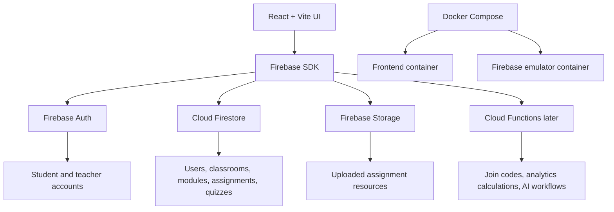

# Factorial N Academy Backend Plan

This app can stay as a React + Vite frontend while Firebase provides the backend services.



## Development Flow

1. Keep the existing mock services while the UI changes quickly.
2. Use Firebase emulators locally so test data does not touch production.
3. Move one screen at a time from mock services to Firebase services.
4. Use real Firebase only after Auth, Firestore rules, and data shape feel stable.

## Main Firebase Services

- Firebase Auth: student and teacher signup/login.
- Firestore: user profiles, teacher profiles, classrooms, modules, assignments, quizzes, submissions, analytics.
- Firebase Storage: assignment files, images, PDFs, slides, and code uploads.
- Cloud Functions later: generated join codes, score calculations, analytics rollups, AI helper workflows.

## Suggested Collections

```txt
users/{userId}
teachers/{teacherId}
students/{studentId}
classrooms/{classroomId}
modules/{moduleId}
assignments/{assignmentId}
quizzes/{quizId}
submissions/{submissionId}
analytics/{classroomId}
```

## Local Commands

```bash
cp .env.example .env
npm run dev
```

Run the full Docker setup:

```bash
docker compose up --build
```

Then open:

- React app: http://localhost:5173
- Firebase emulator UI: http://localhost:4000

## Migration Notes

The new Firebase code lives beside the current mock services. That is intentional. It lets the app keep working while individual pages are moved over to Firebase data.
