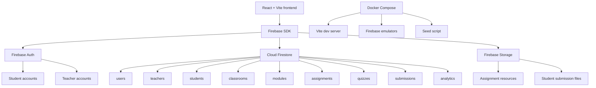

# Factorial N Academy Backend README

This project uses a clean Firebase backend instead of a custom Express/Node server.

The React app talks to Firebase directly through the Firebase client SDK. Mock services still exist as fallbacks so the UI can keep working if Firebase is not configured or if the emulators are not running.

## Architecture



## What Firebase Handles

- Firebase Auth handles student and teacher signup/login.
- Firestore stores app data: users, profiles, classrooms, modules, assignments, quizzes, submissions, and analytics.
- Firebase Storage stores uploaded classroom resources and student submission files.
- Firebase Emulators let you test locally without touching production data.

## Local Setup Without Docker

Create your local env file:

```bash
cp .env.example .env
```

Install dependencies:

```bash
npm install
```

Start Firebase emulators:

```bash
npm run emulators
```

In a second terminal, seed demo data:

```bash
npm run seed:emulators
```

In a third terminal, start the React app:

```bash
npm run dev
```

Open:

- App: http://localhost:5173
- Firebase Emulator UI: http://localhost:4000

Demo accounts:

```txt
Teacher: teacher@factorialn.test / password123
Student: student1@factorialn.test / password123
```

## Local Setup With Docker

Make sure Docker Desktop is installed and running.

Create your local env file:

```bash
cp .env.example .env
```

Start the app and Firebase emulators:

```bash
npm run docker:dev
```

In another terminal, seed demo data into the emulator containers:

```bash
npm run docker:seed
```

Open:

- App: http://localhost:5173
- Firebase Emulator UI: http://localhost:4000

The emulator data is exported into `.firebase-data` when the emulator shuts down and imported again on the next run.

## Firestore Collections

### `users/{userId}`

Stores shared account data for both students and teachers.

```js
{
  displayName: "Demo Educator",
  email: "teacher@factorialn.test",
  role: "teacher", // or "student"
  language: "English",
  createdAt: timestamp
}
```

### `teachers/{teacherId}`

Stores educator profile and onboarding data.

```js
{
  schoolName: "Factorial N Demo School",
  countryRegion: "Canada",
  grades: "Grade 7-9",
  subjects: ["Robotics", "Coding"],
  focusAreas: "Robotics",
  experience: {
    level: "Intermediate",
    certification: "B.Ed"
  }
}
```

### `students/{studentId}`

Stores learner onboarding and goal selections.

```js
{
  onboarding: {
    age: "13-15",
    grade: "middle-school",
    experience: "new"
  },
  goals: {
    weeklyGoalMinutes: "10"
  }
}
```

### `classrooms/{classroomId}`

Stores teacher-owned classrooms.

```js
{
  teacherId: "teacherUid",
  name: "Robotics 8A",
  subject: "Robotics",
  grade: "Grade 7-9",
  joinCode: "ROBO8A",
  studentIds: ["studentUid1", "studentUid2"],
  progress: 74
}
```

### `classroomJoinCodes/{joinCode}`

Stores the minimal lookup needed for a signed-in student to join a classroom
without exposing every classroom record.

```js
{
  classroomId: "robotics-8a",
  teacherId: "teacherUid",
  classroomName: "Robotics 8A",
  createdAt: timestamp
}
```

Joining a classroom adds only the signed-in student's UID to the classroom
`studentIds` array. Firestore rules prevent students from changing any other
classroom fields.

### `modules/{moduleId}`

Stores classroom lesson modules.

```js
{
  classroomId: "robotics-8a",
  teacherId: "teacherUid",
  title: "Module 1",
  lessons: [
    {
      title: "Robotics Foundations",
      description: "Introduce sensors, motors, and classroom safety.",
      time: "35 min"
    }
  ]
}
```

### `assignments/{assignmentId}`

Stores assignment instructions and uploaded resource metadata.

```js
{
  classroomId: "robotics-8a",
  teacherId: "teacherUid",
  title: "Build a Rescue Robot Brief",
  instructions: "Explain the robot mission.",
  dueDate: "Friday",
  resources: ["PDF", "Code file"],
  uploadedResources: [
    {
      name: "brief.pdf",
      path: "classrooms/robotics-8a/assignments/assignmentId/brief.pdf",
      url: "https://..."
    }
  ]
}
```

### `quizzes/{quizId}`

Stores quiz metadata.

```js
{
  classroomId: "robotics-8a",
  teacherId: "teacherUid",
  title: "Robotics Safety Quiz",
  questionCount: 8,
  average: 86
}
```

### `submissions/{submissionId}`

Student submissions use a stable ID composed from the assignment and student
IDs. This prevents duplicate submissions for the same assignment.

```js
{
  classroomId: "robotics-8a",
  assignmentId: "assignment-1",
  studentId: "studentUid",
  response: "My written response",
  uploadedFiles: [
    {
      name: "robot-code.py",
      path: "classrooms/robotics-8a/submissions/studentUid/assignment-1/robot-code.py",
      url: "https://..."
    }
  ],
  status: "Submitted",
  submittedAt: timestamp
}
```

Students can read only their own submissions. Teachers can read and grade
submissions belonging to classrooms they own.

Stores student assignment submissions and teacher feedback.

```js
{
  classroomId: "robotics-8a",
  assignmentId: "assignment-1",
  studentId: "studentUid",
  status: "Submitted",
  grade: 86,
  feedback: "Clear route plan."
}
```

### `analytics/{classroomId}`

Stores teacher-facing classroom analytics.

```js
{
  classroomId: "robotics-8a",
  teacherId: "teacherUid",
  summary: {
    students: 3,
    completionRate: 76,
    quizAverage: 82
  },
  assignmentGrades: [],
  quizGrades: [],
  moduleCompletion: []
}
```

## Storage Paths

Assignment resources:

```txt
classrooms/{classroomId}/assignments/{assignmentId}/{fileName}
```

Student submissions:

```txt
classrooms/{classroomId}/submissions/{studentId}/{fileName}
```

## Security Model

- Users can read/update only their own `users/{userId}` document.
- Teachers can read/update only their own `teachers/{teacherId}` document.
- Students can read/update only their own `students/{studentId}` document.
- Teachers can create and manage classrooms they own.
- Students can read classrooms only if their user ID is in `studentIds`.
- Teachers can create/update modules, assignments, quizzes, and analytics for their own classrooms.
- Students can create submissions only for themselves and only inside classrooms they belong to.
- Assignment resource files are writable only by the classroom teacher.
- Submission files are writable only by the submitting student.

## Current Fallback Pattern

Most Firebase-connected services follow this pattern:

```txt
Try Firebase
If Firebase fails or is unavailable, use the mock/localStorage service
```

This keeps the demo resilient while the backend is still being developed.

## Useful Commands

```bash
npm run lint
npm run build
npm run emulators
npm run seed:emulators
npm run docker:dev
npm run docker:seed
```
